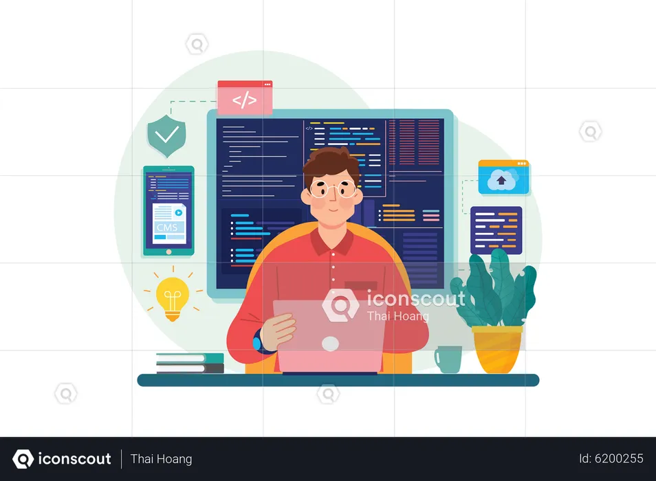

<h1 align="center">Hello I'm Dipesh K. Gulati</h1>

## 👨🏻‍💻 About Me:

- 🙋‍♂️ All about me is at **[My Website](https://dipesh-k-gulati.vercel.app/)**

- 🔭 I'm currently working on `Full Stack Web Development Projects`

- 🌱 I'm currently learning `Next.js and TypeScript`

- 👯 I'm looking to collaborate on `Open Source Projects`

- 🤔 I'm looking for `Software Development Opportunities`

- 💬 Ask me about `Web Development, DSA, and System Design`

- 👨‍💻 Life Hack: Learn new tech 🔥 and share what you have learned :tada:

## 🛠️ Technologies and Tools I use:

## 📊 GitHub Stats:

    

    

    

## ❤️ Let's get connected:

   

